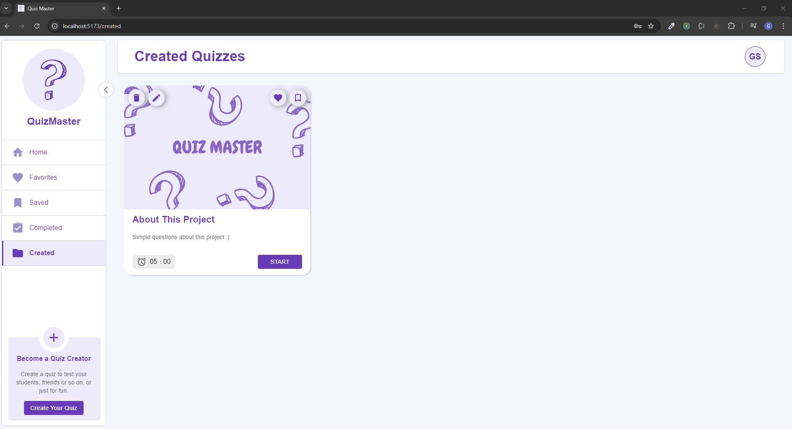

<h1> QuizMaster - Quiz App Project </h1>

<h2> 🌐 Overview </h2>

&nbsp;&nbsp;&nbsp; QuizMaster is a quiz app project created to enhance my portfolio and personal development. The project has evolved over time, incorporating various features and improvements to meet its evolving requirements.

<h2> 💻 Technologies Used </h2>

* <strong> Frontend: </strong> React.js with Typescript
* <strong> Backend: </strong> Express.js with Typescript
* <strong> Database: </strong> MongoDB
* <strong> Helper packages: </strong> Redux-toolkit, Redux-thunk, React-router, Material UI, React-hook-form, Axios, Notistack, Jsonwebtoken, Multer, Mongoose, Joi, ...

<h2> 🎬 Project Overview </h2>
<strong> What is this application and how to use it ? </strong>
<video controls>
  <source src="./images/Overview.mp4" type="video/mp4">
  Your browser does not support the video tag.
</video>
 

<h2> 📷 Screenshots </h2>
<strong> LOGIN PAGE </strong>
 
 

<strong> REGISTER PAGE </strong>
 
 

<strong> FEED PAGE - User for not logged in </strong>
 
 

<strong> FEED PAGE - User for logged in </strong>
 
 

<strong> FAVORITES PAGE </strong>
 
 

<strong> SAVED PAGE </strong>
 
 

<strong> COMPLETED PAGE </strong>
 
 

<strong> CREATED PAGE </strong>
 
 

<strong> CREATOR PAGE - Quiz Settings </strong>
 
 

<strong> CREATOR PAGE - Image Cropper </strong>
 
 

<strong> CREATOR PAGE - Multiple Question </strong>
 
 

<strong> CREATOR PAGE - True/False Question </strong>
 
 

<strong> CREATOR PAGE - Multiple Question </strong>
 
 

<strong> CREATOR PAGE - Short Answer Question </strong>
 
 

<strong> QUIZ RULES PAGE </strong>
 
 

<strong> QUIZ PAGE </strong>
 
 

<strong> QUIZ PAGE - Multiple Question </strong>
 
 

<strong> QUIZ PAGE - True/False Question </strong>
 
 

<strong> QUIZ PAGE - Complete Quiz </strong>
 
 

<strong> QUIZ RESULT PAGE - Summary </strong>
 
 

<strong> QUIZ RESULT PAGE - Questions/Answers </strong>
 
 

<strong> PROFILE PAGE </strong>
 
 

<strong> PROFILE PAGE - Change Password </strong>
 
 

<strong> PROFILE PAGE - Image Cropper </strong>
 
 

<h2> 🚀 Features </h2>

* <strong> Quiz Creating: </strong> Create quizzes with different types of questions and options.
* <strong> Quiz Interaction: </strong> Choose the quizzes they like and save them to solve later.
* <strong> Scoring: </strong> View the results of each exam you have solved and see your mistakes, if any 😊
* <strong> Profile customization: </strong> Customize your profile to introduce yourself.
 
<h2> 🔄 Project Evolution </h2>

&nbsp;&nbsp;&nbsp; Starting as a simple React project on January 1st, this application has evolved into a comprehensive full-stack solution over time, incorporating various ideas and technologies. The project provided opportunities to explore new approaches and gain valuable experience with different technologies. Future plans include adding features that are yet to be implemented.

<h2> 🔍 Future Improvements </h2>

&nbsp;&nbsp;&nbsp; While the project has achieved several milestones, there are areas for improvement: 

* Create questions with pictures and videos.
* Get notification for your actions.
* Comment to give your opinions about the quizzes you have solved.
* Create a dashboard structure that shows your progress.
* Provide the opportunity to select more than one option for multiple choice questions.

<h2> 🏁 Getting Started </h2>

&nbsp;&nbsp;&nbsp; To run the project locally, follow these steps: 

* Clone the repository. <code> git clone https://github.com/GoktugSulun/QuizMaster.git </code>
* Install dependencies using <code>npm install</code> in root folder.
* Create a <code>.env</code> file in the frontend folder and write <code>VITE_API_URL = "http://localhost:8000"</code> in it. (PORT must be the equal to the port in the backend env file)
* Create a <code>.env</code> file in the backend folder and write <code>TOKEN_SECRET = "your_secure_random_string", DB_CONNECTION_URL = "your_mongodb_url", PORT = "an_available_port"</code> (Generate a secure random string to enhance security.)
* Run the project with <code>npm start</code> in root folder.
